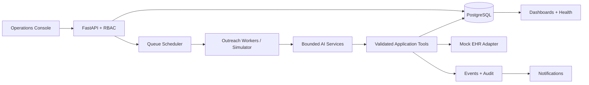

# Architecture

This prototype is a multi-tenant healthcare operations system built around an
explicit outbound queue. It uses synthetic data only and is not for clinical use.

## Trust boundaries

- The API authenticates users and derives tenant context from the signed token.
- Every patient-domain model carries `hospital_id`; repository queries must include it.
- PostgreSQL row-level security is planned as defense in depth.
- Patient text, retrieved protocols, and model output are untrusted inputs.
- AI services receive task-specific context and cannot access SQL or arbitrary tools.
- AI tool requests pass authorization, schema validation, business rules, idempotency,
  execution, and audit before side effects occur.
- The mock EHR is behind a replaceable adapter; failures are explicit.

## AI responsibilities

The planned AI layer separates voice intake, structured triage, two independent
escalation assessments, conservative consensus, and documentation. Deterministic
protocol rules can always force escalation. Malformed outputs fail validation and
become visible operational failures after bounded repair attempts.

## Prototype scaling path

The in-process simulation demonstrates behavior, not distributed execution. A deployed
implementation should use PostgreSQL transactional leasing with `FOR UPDATE SKIP LOCKED`,
worker heartbeats, lease expiry, an outbox table, and independently scalable workers.