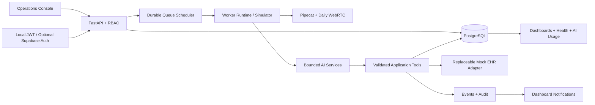

# Architecture

This synthetic prototype is a multi-tenant healthcare operations system built
around an explicit PostgreSQL-backed outreach queue.

## Implemented boundaries

- Signed identity establishes role and hospital context.
- Patient-domain tables carry `hospital_id`; backend reads and writes are tenant scoped.
- PostgreSQL reservations use tenant advisory locks, row locks, leases and
  `FOR UPDATE SKIP LOCKED`.
- The worker can run inside the API for free-tier deployment or independently through
  `Dockerfile.worker`.
- Patient text, documents and model output are untrusted inputs.
- AI-requested actions pass authentication, tenant authorization, schema validation,
  business rules, idempotency, execution and audit.
- Mock-EHR writes pass through a replaceable tenant-validating adapter.
- Voice-session creation sends only an opaque task reference to Pipecat/Daily.
- Provider failures have explicit states and a circuit-breaker abstraction.

## AI responsibilities

1. Voice intake verifies identity and consent and collects protocol-driven information.
2. Clinical triage produces validated observations and evidence.
3. Two independent assessment paths detect red flags and uncertainty.
4. Conservative consensus selects the highest severity and escalates disagreement.
5. Documentation creates structured communication and follow-up records.

Deterministic assessment is intentional: it makes the fixed safety evaluation
reproducible and prevents provider availability from bypassing clinical rules.

## Scaling

API replicas remain stateless. Worker replicas coordinate through PostgreSQL locks and
leases. Queue selection is tenant serialized while different hospitals can schedule in
parallel. Production deployment should place the worker in a separate service, add a
durable outbox/dead-letter consumer, and use a restricted database role with RLS.